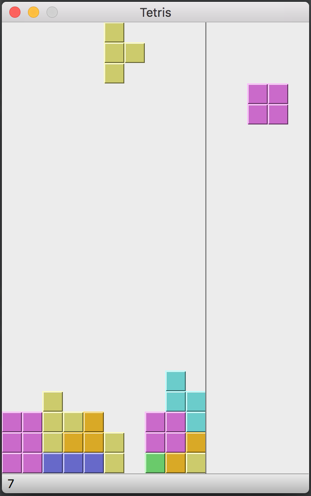

# Tetris Game

It is a python implementatino of Tetris Game, and a simple AI to play game automatically.

Need python3, PyQt5 and NumPy to be installed.

* `tetris_game.py` is the main application.
* `tetris_model.py` is the data model for this game.
* `tetris_ai.py` is the AI part.

Run `tetris_game.py` from command line and you start to play or watch the AI playing.

```shell
$ python3 tetris_game.py
```

### Play manually

If you want play by yourself, you should uncomment this line in `tetris_game.py`:

```python
# TETRIS_AI = None
```

Or just comment this line:

```python
from tetris_ai import TETRIS_AI
```

Current config could be too fast for human player. So you may want make it slower, by changing value of `Tetris.speed` defined here:

```python
class Tetris(QMainWindow):
    ...
    def initUI(self):
        ...
        self.speed = 10
```

### Play rules

Just like classical Tetris Game. You use *up* key to rotate a shape, *left* key to move left and *right* key to move right. Also you can use *space* key to drop down current shape immediately. If you want a pause, just press *P* key. The right panel shows the next shape.

~ HAVE FUN ~

